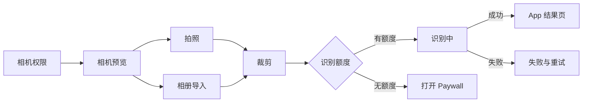

# BioScanKit 跨平台共用组件设计文档

## 1. 文档信息

- 状态：v0.1 已落地，按应用渐进接入
- 适用平台：iOS
- 基准应用：iNature
- 首批适配应用：iNature、Mr.Mushroom、Mr.Rock、NatureEar
- 暂不包含：fish、Android、Watch App
- 重点组件：
  - 设置页
  - 拍照识别与裁剪流程
  - Paywall

### 1.1 当前落地状态

- 本地 Package：`local-packages/BioScanKit`
- 已实现产品：`BioScanDesign`、`BioScanSettings`、`BioScanCapture`、`BioScanPaywall` 和聚合产品 `BioScanKit`
- iNature：已接入共用设置页、相机页、裁剪页和 iNature 风格 Paywall
- Mr.Mushroom：已接入共用设置页、相机页、裁剪/处理页面和卡片选择风格 Paywall
- Mr.Rock：已接入共用设置页、相机页、裁剪/处理页面和卡片选择风格 Paywall
- NatureEar：已接入共用设置页和 iNature 风格 Paywall；只依赖 `BioScanDesign`、`BioScanSettings` 与 `BioScanPaywall`
- NatureEar 当前没有拍照识别能力，不接入 `BioScanCapture`
- 各 App 继续使用原有 RevenueCat 服务、产品 ID、额度键和入账逻辑
- iNature、Mr.Mushroom 与 Mr.Rock 使用共用 `CameraPage` 页面容器
- 各 App 将现有相机 Preview 注入 `CameraPage`，继续保留自己的相机驱动、裁切拍摄、识别模型、额度检查、Coach Mark 和结果路由
- Package 同时提供可直接使用的 `CameraScreen` 和完整相机、相册选择、识别流程容器

## 2. 背景与目标

多个识别类 App 当前分别维护设置页、拍照识别流程、图片裁剪页面、购买额度和 Paywall。页面结构与业务规则存在大量重复，但文案、品牌色、素材、识别模型和结果数据又各不相同。

本次组件化以 iNature 的页面结构、交互方式和视觉表现为默认基准，把稳定的页面能力抽取为一个本地 Swift Package。其他 App 通过配置、协议实现和少量 View 插槽适配自己的品牌。

目标：

1. iNature 接入组件后，页面外观和行为保持基本不变。
2. 设置、相机、裁剪、购买等通用逻辑只维护一份。
3. 其他 App 可以配置颜色、字体、文案、图片、产品和功能开关。
4. 识别模型、识别结果、历史记录等领域业务继续归各 App 所有。
5. Paywall 保留两种明确的页面风格，共用同一个购买和额度核心。
6. 组件最低支持 iOS 16。

非目标：

1. 不统一植物、蘑菇、岩石、鸟类的识别结果模型。
2. 不把所有 App 的差异都做成组件内部条件分支。
3. 不在第一阶段重构结果页、历史页和详情页。
4. 不在组件中硬编码 RevenueCat API Key、产品 ID 或 App 的 `UserDefaults` key。

## 3. 总体原则

### 3.1 iNature 是默认实现

组件提供 `.iNature` 默认 Theme 和页面配置。iNature 本身只保留薄封装、业务 Client 和路由，不再复制完整页面。

### 3.2 页面结构稳定，品牌表现可配置

配置分为三层：

- Theme：颜色、字体、圆角、间距和阴影。
- Configuration：文案、产品、功能开关、链接等页面数据。
- View Slot：Logo、吉祥物、复杂 Hero 等无法用简单数据表达的内容。

不开放任意页面重排，避免配置对象无限膨胀。

### 3.3 业务逻辑和页面渲染分离

页面只渲染状态和发送用户动作。相机、识别、购买、额度、外链等能力通过 Store 或协议注入。

### 3.4 App 持有领域模型

公共组件可以定义识别流程状态，但具体识别结果使用泛型，由 App 自己定义。

### 3.5 不依赖 App 单例

Package 内不能直接引用：

- `RevenueCatService.shared`
- `AppAnalytics`
- `AppTheme`
- `AppStrings`
- App 自己的 `AppState`
- App Bundle 中未经注入的资源

这些依赖通过协议、配置、Binding 或闭包传入。

## 4. 仓库结构

建议 Package 名称：`BioScanKit`。

```text
BioScanKit
├── iOS
│   ├── Package.swift
│   ├── Sources
│   │   ├── BioScanDesign
│   │   ├── BioScanSettings
│   │   ├── BioScanCapture
│   │   ├── BioScanPaywall
│   │   └── BioScanCloudSync
│   └── Tests
│       ├── BioScanCaptureTests
│       ├── BioScanPaywallTests
│       └── BioScanSettingsTests
├── Android
│   ├── build.gradle.kts
│   └── src/main/java/com/bioscankit/android
│       ├── design
│       ├── settings
│       ├── capture
│       └── paywall
├── Shared
│   ├── RecommendedApps.json
│   └── Icons
├── Docs
└── Scripts
```

建议拆成多个 SwiftPM target，使设置页不会被迫链接 AVFoundation 或 RevenueCat。

## 5. 设计系统

### 5.1 BioScanTheme

```swift
public struct BioScanTheme {
    public let accent: Color
    public let success: Color
    public let warning: Color

    public let pageBackground: AdaptiveColor
    public let cardBackground: AdaptiveColor
    public let elevatedCardBackground: AdaptiveColor
    public let primaryText: AdaptiveColor
    public let secondaryText: AdaptiveColor
    public let border: AdaptiveColor

    public let cardCornerRadius: CGFloat
    public let buttonCornerRadius: CGFloat
    public let horizontalPadding: CGFloat
    public let sectionSpacing: CGFloat
    public let fontDesign: Font.Design
}
```

Package 提供：

```swift
extension BioScanTheme {
    public static let iNature: BioScanTheme
}
```

其他 App 在自己的工程中定义：

```swift
extension BioScanTheme {
    static let mushroom: BioScanTheme
    static let rock: BioScanTheme
    static let natureEar: BioScanTheme
}
```

### 5.2 AdaptiveColor

由于主要页面需要适配浅色和深色模式，建议使用明确的颜色结构，而不是在每个 View 中重复判断 `colorScheme`。

```swift
public struct AdaptiveColor {
    public let light: Color
    public let dark: Color

    public func resolve(for colorScheme: ColorScheme) -> Color
}
```

### 5.3 素材策略

- 通用 SF Symbols 由 Package 使用。
- iNature 默认通用图片可以放在 Package Resources。
- App Logo、GIF、吉祥物、识别示例图保留在 App Bundle。
- 复杂素材使用 View Slot 注入，避免 Package 猜测资源 Bundle。

## 6. 设置页组件

### 6.1 页面职责

设置页组件负责：

- 页面背景、标题、滚动布局和 Section 样式。
- 外观模式选择。
- App 版本展示。
- 隐私政策、用户协议、反馈和评分入口。
- 系统设置、语言设置跳转。
- Restore Purchase 的加载和结果提示。
- 推荐 App 配置读取、过滤和卡片展示。
- 会员状态卡的标准容器。
- 历史记录与收藏入口的共用 Section、计数文案和导航交互。

App 负责：

- 实际链接、邮箱和 App Store ID。
- Appearance 的存储方式。
- 恢复购买的具体实现。
- 历史/收藏的数据模型、持久化、列表页和详情页；Package 只通过 destination 插槽导航到 App 原有页面。
- 清除历史、离线包、调试工具等专属操作。
- 会员状态数据。
- App 专属埋点。

### 6.2 配置模型

```swift
public struct SettingsConfiguration {
    public let appName: String
    public let theme: BioScanTheme
    public let copy: SettingsCopy

    public let privacyPolicyURL: URL?
    public let termsOfUseURL: URL?
    public let feedbackEmail: String?
    public let appStoreID: String?

    public let showsAppearance: Bool
    public let showsLanguage: Bool
    public let showsRestorePurchase: Bool
    public let showsRecommendedApps: Bool
    public let recommendedAppsResourceName: String
}
```

```swift
public struct SettingsCopy {
    public let title: String
    public let generalSectionTitle: String
    public let dataSectionTitle: String
    public let toolsSectionTitle: String
    public let supportSectionTitle: String
    public let recommendedAppsTitle: String
    public let privacyPolicyTitle: String
    public let termsOfUseTitle: String
    public let feedbackTitle: String
    public let restorePurchaseTitle: String
    public let rateAppTitle: String
}
```

### 6.3 Actions

```swift
public struct SettingsActions {
    public let restorePurchases: @MainActor () async throws -> RestoreResult
    public let trackEvent: @MainActor (SettingsEvent) -> Void
    public let openCustomURL: @MainActor (URL) -> Void
}
```

### 6.4 页面入口

```swift
SettingsScreen(
    configuration: configuration,
    appearance: $appearance,
    membershipState: membershipState,
    actions: actions
) {
    AppSpecificSettingsSections()
}
```

额外 Section 使用 `@ViewBuilder` 注入。公共数组模型不使用 `AnyView`。

iNature 使用 `SettingsPageContainer` 保留既有页面外壳和信息架构。该容器抽取渐变背景、滚动区域、版本入口、内容最大宽度和 iPad 双栏断点，并通过 `SettingsPageMetrics` 将布局信息传给 App；`GENERAL / DATA / TOOLS / LEGAL & SUPPORT / OTHER APPS` 等原有分区作为内容注入，因此组件化不会重排 iNature 的设置入口或改变原卡片视觉。

其他 App 若采用标准化设置结构，继续使用 `SettingsScreen`；需要严格保留既有分区结构时使用 `SettingsPageContainer`。

### 6.5 存储边界

设置组件不直接声明各 App 的 `@AppStorage`。App 在包装页面中读取原有 key，再传入 Binding：

```swift
struct AppSettingsView: View {
    @AppStorage("appearance_mode")
    private var appearance = AppearanceMode.system

    var body: some View {
        SettingsScreen(
            configuration: .iNature,
            appearance: $appearance,
            membershipState: membershipState,
            actions: actions
        )
    }
}
```

## 7. 拍照识别流程组件

### 7.1 流程范围



### 7.2 公共状态

```swift
public enum PhotoRecognitionPhase<Result> {
    case permission(CameraPermissionState)
    case camera
    case cropping(CapturedPhoto)
    case recognizing(UIImage)
    case failed(RecognitionFailure)
    case completed(Result)
}
```

建议由 `PhotoRecognitionStore` 持有流程状态，View 只负责显示。

```swift
@MainActor
public final class PhotoRecognitionStore<Client: PhotoRecognitionClient>: ObservableObject {
    @Published public private(set) var phase: PhotoRecognitionPhase<Client.Result>

    public func requestCameraAccess()
    public func importPhoto()
    public func capturePhoto()
    public func confirmCrop(_ image: UIImage)
    public func retry()
    public func cancel()
}
```

### 7.3 识别协议

```swift
public protocol PhotoRecognitionClient: Sendable {
    associatedtype Result: Sendable

    func recognize(
        image: UIImage,
        context: RecognitionContext
    ) async throws -> Result
}
```

```swift
public struct RecognitionContext: Sendable {
    public enum Source: Sendable {
        case camera
        case photoLibrary
        case guideDemo
    }

    public let source: Source
    public let location: CLLocationCoordinate2D?
    public let isGuideDemo: Bool
}
```

各 App 使用 Adapter 将已有识别服务接入该协议。

### 7.4 额度协议

```swift
public protocol RecognitionAccessControlling: Sendable {
    func currentAccess() async -> RecognitionAccess
    func consumeAfterSuccessfulRecognition() async throws
}
```

```swift
public enum RecognitionAccess: Sendable {
    case unlimited
    case credits(Int)
    case unavailable
}
```

流程组件在识别前检查额度，在成功后调用消费接口。具体免费次数、付费次数和 Lifetime 规则由 App 或 Paywall Core 提供。

### 7.5 页面配置

```swift
public struct PhotoRecognitionConfiguration {
    public let theme: BioScanTheme
    public let camera: CameraScreenConfiguration
    public let crop: CropEditorConfiguration
    public let processing: ProcessingScreenConfiguration

    public let showsMembershipStatus: Bool
    public let supportsPhotoLibrary: Bool
    public let supportsFlash: Bool
    public let supportsTapToFocus: Bool
    public let supportsPinchToZoom: Bool
}
```

Package 提供 `.iNature` 默认值。

### 7.5.1 相机页面容器

`CameraPage` 是实际接入各 App 的整页相机容器。它负责：

- 顶部关闭、帮助和状态区域。
- 识别提示、品牌取景框和暗角。
- 相册、快门、闪光灯控制。
- 双指缩放和点击对焦事件。
- 分别回传页面坐标与相机预览本地坐标：页面坐标供 Coach Mark 使用，预览本地坐标供实际裁切拍摄使用。
- Processing、可拍摄、关闭按钮等页面状态。
- 支持角标式、扫描式取景框、引导演示图、相册缩略图和处理状态快门。
- 提供 `.iNatureLegacy` 与 `.adaptive` 两种页面布局：前者严格保留 iNature 原拍照页的固定 320pt 取景区域、300pt 取景框、42pt 两侧按钮、84/64pt 快门及原上下边距；后者供 Mushroom、Rock 等扫描式页面按屏幕高度自适应。
- `finderColor` 可独立覆盖主题强调色，避免主题统一后改变原 App 取景框颜色。
- 相机手势可根据帮助弹层、新手引导步骤和处理中状态独立禁用。

相机 Preview 通过泛型 View Slot 注入，因此组件不要求各 App 同时替换底层 `AVCaptureSession`：

```swift
CameraPage(
    configuration: CameraScreenConfiguration(
        theme: .iNature,
        finderMaximumSize: 300,
        finderColor: Color(red: 0.18, green: 0.55, blue: 0.24),
        layoutStyle: .iNatureLegacy
    ),
    flashEnabled: $flashEnabled,
    zoomFactor: $zoomFactor,
    isProcessing: isRecognizing,
    isCaptureEnabled: canCapture,
    actions: CameraPageActions(
        close: dismiss,
        showHelp: showHelp,
        choosePhoto: openPhotoLibrary,
        capture: capturePhoto,
        focus: focusCamera,
        focusFrameChanged: updateCoachMarkFrame,
        cropFrameChanged: updatePreviewCropFrame,
        captureFrameChanged: updateCoachMarkFrame
    )
) {
    AppCameraPreview(...)
} extraOverlay: {
    AppCoachMarkAndFeedbackOverlay(...)
}
```

当新 App 没有自定义相机驱动时，可以直接使用 Package 自带的 `CameraScreen`；已有成熟相机驱动的 App 使用 `CameraPage`，避免迁移时损失设备兼容和拍摄能力。

`ImageCropEditor` 同时提供确认按钮位置回传和外部确认触发，用于保留 Mushroom、Rock 原有的裁剪步骤聚光引导，并确保引导触发的仍是公共裁剪逻辑。

### 7.6 App 保留内容

以下内容不进入公共拍照流程：

- Core ML 或 ONNX 模型。
- 植物、蘑菇、岩石、鸟类结果结构。
- 候选项和置信度规则。
- 历史记录持久化。
- 训练图片上传。
- 结果页导航和详情页。
- App 专属 Coach Mark 内容。
- App 专属埋点名称。

组件通过回调把结果交还给 App：

```swift
PhotoRecognitionFlow(
    store: store,
    configuration: .iNature,
    onShowPaywall: {
        showPaywall = true
    },
    onResult: { result in
        route.append(.result(result))
    }
)
```

## 8. 裁剪页组件

### 8.1 拆分

现有 iNature 裁剪页中的职责建议拆为：

- `ImageCropEditor`：拖动、缩放、重置和图片输出。
- `CropGeometry`：显示区域、最小缩放、偏移限制、归一化裁剪区域计算。
- `CropOverlay`：遮罩、网格、边框和轨道动画。
- `CropEditorChrome`：顶部关闭、引导文案和底部确认面板。
- `RecognitionProcessingScreen`：识别动画，独立于裁剪页面。

### 8.2 配置

```swift
public struct CropEditorConfiguration {
    public let theme: BioScanTheme
    public let aspectRatio: CGFloat
    public let cropScale: CGFloat
    public let cornerRadius: CGFloat
    public let showsGrid: Bool
    public let showsPreview: Bool
    public let allowsReset: Bool
    public let guidanceText: String
    public let confirmTitle: String
    public let animationStyle: CropBorderAnimationStyle
    public let layoutStyle: CropEditorLayoutStyle
}
```

iNature 默认值：

- 正方形裁剪框。
- 裁剪框占可用区域约 78%。
- 圆角 14。
- 显示网格。
- 绿色强调色。
- 使用 `.iNatureLegacy` 布局，不启用公共版脉冲边框。
- 顶部保留 42pt 关闭按钮和独立引导卡。
- 底部保留右侧 56pt 裁剪预览以及 `Reset / Use Crop` 双按钮。
- 遮罩、网格线、画布预留高度和 Light / Dark 渐变严格沿用组件化前参数。

Mushroom、Rock 的显式配置默认继续使用 `.adaptive`，保留顶部 Reset、单确认按钮、外部确认触发和 Coach Mark 定位能力。

### 8.3 接口

```swift
ImageCropEditor(
    image: image,
    configuration: .iNature,
    onCancel: {
        store.cancelCrop()
    },
    onConfirm: { croppedImage in
        store.confirmCrop(croppedImage)
    }
)
```

### 8.4 Processing / Loading 页面

`RecognitionProcessingScreen` 提供 `.iNatureLegacy` 与 `.adaptive` 两种布局。iNature 默认使用原版 Loading Renderer，保留：

- `AI SCAN` 标题及五段状态时间线。
- 原图扫描卡、四角标记、扫描光束和特征点。
- 底部进度轨道与等待结果胶囊。
- 原版 Light / Dark 三层渐变、环境光动画和屏幕尺寸计算。
- Reduce Motion 下的静态完成状态。

Rock 等已有扫描式 Processing 页面继续使用 `.adaptive`，不受 iNature 原版时间线影响。

### 8.5 算法测试

`CropGeometry` 必须覆盖：

- 横图、竖图、正方形图片。
- 不同屏幕宽高比。
- 图片方向归一化。
- 最小和最大缩放。
- 拖动边界限制。
- 旋转设备后的裁剪区域。
- 裁剪区域不越界。

## 9. Paywall 组件

### 9.1 两种页面风格

Paywall 保留两套独立 Renderer：

```swift
public enum PaywallStyle: Sendable {
    case iNature
    case cardSelection
}
```

#### iNature 风格

以 iNature 当前 Paywall 为基准：

- Close / Restore 顶栏。
- 原版离线识别 Hero 文案和卡片尺寸。
- 仅在加载或失败时显示 App Store 连接状态。
- `Lifetime Pro` 主卡，包括一次性购买价格面板、五条权益、价值进度条和 `LIMITED OFFER` 标签。
- 5 次、20 次 Credits 双列卡片。
- 底部固定 CTA，标题随 Lifetime、5 次或 20 次选项变化。
- 原版 Light / Dark 色值、圆角、描边、阴影、字体和上下间距。
- iPad 宽屏适配。

`.iNature` 主风格内部提供两个布局选项：

```swift
public enum INaturePaywallLayoutStyle: Sendable {
    case standard
    case legacyINature
}
```

`legacyINature` 只由 iNature 使用，用于严格对齐组件化前页面；`standard` 保留给 NatureEar 等共享 Lifetime + Credits 结构但不应出现扫描识别文案的 App。该划分不会增加第三种 Paywall 主风格，也不会影响 `.cardSelection`。

建议使用：

- iNature：`.iNature + .legacyINature`。
- NatureEar：`.iNature + .standard`。

#### Card Selection 风格

以 Mr.Mushroom 和 Mr.Rock 当前 Paywall 为基准：

- 5 次、20 次、Lifetime 三个套餐选择卡。
- 明确的单选状态。
- 推荐、节省、原价等标签。
- 剩余扫描次数展示。
- CTA 随选择产品变化。
- Logo、GIF 或吉祥物区域。
- 更紧凑的竖向页面。

建议使用：

- Mr.Mushroom。
- Mr.Rock。

Card Selection 的页面结构与品牌主题分离。布局继续共用，App 通过
`CardSelectionPaywallTheme` 注入浅色/深色背景渐变、卡片与文字颜色、
Lifetime 渐变、CTA、阴影、状态色以及 Hero 尺寸和圆角。未传入独立主题时，
组件从 `BioScanTheme` 派生默认值；Mr.Rock 保留 `legacyRock` 精确主题，
Mr.Mushroom 注入原版珊瑚粉与红棕主题。

### 9.2 页面入口

```swift
PaywallScreen(
    style: .iNature,
    configuration: configuration,
    store: paywallStore
)
```

统一入口内部选择两个独立 View：

```swift
public struct PaywallScreen: View {
    public var body: some View {
        switch configuration.style {
        case .iNature:
            INaturePaywallView(
                store: store,
                configuration: configuration
            )

        case .cardSelection:
            CardSelectionPaywallView(
                store: store,
                configuration: configuration
            )
        }
    }
}
```

不在同一个大 View 中对每个 Section 使用风格条件判断。

### 9.3 公共购买状态

```swift
@MainActor
public final class PaywallStore: ObservableObject {
    @Published public private(set) var products: [String: BillingProduct] = [:]
    @Published public private(set) var entitlement: EntitlementState = .unknown
    @Published public private(set) var creditBalance: CreditBalance
    @Published public private(set) var operation: BillingOperation = .idle
    @Published public var selectedProductID: String?

    public func loadProducts() async
    public func purchaseSelectedProduct() async
    public func restorePurchases() async
    public func refreshEntitlements() async
}
```

```swift
public enum BillingOperation: Equatable {
    case idle
    case loadingProducts
    case purchasing(productID: String)
    case restoring
    case succeeded
    case failed(message: String)
}
```

### 9.4 Billing 协议

```swift
public protocol BillingClient: Sendable {
    func loadProducts(
        identifiers: [String]
    ) async throws -> [BillingProduct]

    func purchase(
        productID: String
    ) async throws -> PurchaseResult

    func restorePurchases() async throws -> EntitlementState

    func refreshEntitlements() async throws -> EntitlementState
}
```

RevenueCat 只作为该协议的一个实现。页面和 `PaywallStore` 不直接引用 RevenueCat 类型。

### 9.5 产品配置

```swift
public struct PaywallConfiguration {
    public let style: PaywallStyle
    public let theme: BioScanTheme
    public let copy: PaywallCopy
    public let catalog: PurchaseCatalog
    public let features: PaywallFeatures
}
```

```swift
public struct PaywallProduct: Identifiable, Sendable {
    public enum Kind: Sendable {
        case lifetime
        case credits(Int)
    }

    public let id: String
    public let kind: Kind
    public let title: String
    public let subtitle: String
    public let badge: String?
}
```

```swift
public struct PaywallFeatures: Sendable {
    public let showsSavings: Bool
    public let showsAssurance: Bool
    public let showsCreditBalance: Bool
    public let showsOriginalPrice: Bool
    public let automaticallySelectLifetime: Bool
}
```

### 9.6 Credits 和 Lifetime

```swift
public struct CreditBalance: Equatable, Sendable {
    public let free: Int
    public let paid: Int
    public let hasUnlimitedAccess: Bool

    public var total: Int {
        hasUnlimitedAccess ? .max : free + paid
    }
}
```

购买和恢复的规则：

- Consumable 购买成功后增加对应 paid credits。
- Lifetime 购买成功后更新 Entitlement。
- Restore 主要恢复非消耗型 Lifetime。
- Restore 不承诺恢复已消费或未同步的 consumable credits。
- 消费识别次数时优先消费 free 或 paid 的顺序必须统一定义。
- 重复回调不能重复增加 consumable credits。

### 9.7 存储迁移

每个 App 当前存储 key 不同，Package 必须接收存储配置：

```swift
public struct CreditStorageConfiguration: Sendable {
    public let freeCreditsKey: String
    public let paidCreditsKey: String
    public let freeCreditsUsedKey: String?
    public let lifetimeCacheKey: String
    public let didSeedFreeCreditsKey: String
    public let lastVerifiedKey: String?
}
```

要求：

- iNature 第一版继续读取现有 key。
- 其他 App 继续读取各自现有 key。
- 如果以后统一 key，需要显式 Migration，不允许直接重命名。
- Lifetime entitlement 以 RevenueCat CustomerInfo 为最终依据，本地只做缓存。

### 9.8 App 配置示例

```swift
// iNature
let configuration = PaywallConfiguration(
    style: .iNature,
    theme: .iNature,
    copy: .iNature,
    catalog: .iNature,
    features: .iNature
)
```

```swift
// Mr.Mushroom
let configuration = PaywallConfiguration(
    style: .cardSelection,
    theme: .mushroom,
    copy: .mushroom,
    catalog: .mushroom,
    features: .cardSelectionDefaults
)
```

## 10. Analytics

Package 不依赖 Firebase Analytics 或 App 自己的 Analytics 单例。

```swift
public protocol BioScanAnalytics: Sendable {
    func track(_ event: BioScanEvent)
}
```

公共事件建议：

- settingsShown
- settingsActionTapped
- cameraShown
- cameraPermissionRequested
- photoCaptured
- photoImported
- cropConfirmed
- cropCancelled
- recognitionStarted
- recognitionSucceeded
- recognitionFailed
- paywallShown
- productSelected
- purchaseStarted
- purchaseSucceeded
- purchaseCancelled
- purchaseFailed
- restoreStarted
- restoreSucceeded
- restoreFailed

App Adapter 再把公共事件映射到现有 AppAnalytics 事件名和参数。

## 11. 本地化

- Package 不直接依赖 App 的 `AppStrings`。
- 页面文案通过 `SettingsCopy`、`RecognitionCopy`、`CropCopy`、`PaywallCopy` 传入。
- Package 自己的通用兜底文案使用 `Bundle.module`。
- App 自己的本地化内容由 App 构建配置时提供。
- 不把已经本地化的字符串再次作为本地化 key 处理。

## 12. 并发与状态所有权

- UI Store 标记 `@MainActor`。
- 异步识别和购买通过 `Task` 执行。
- 页面消失或用户取消时，识别 Task 必须取消。
- View 内部状态使用 `private @State`。
- View 拥有的 `ObservableObject` 使用 `@StateObject`。
- 外部注入的 Store 使用 `@ObservedObject`。
- 只读数据使用 `let`，子 View 需要修改父状态时才使用 `@Binding`。
- Package 以 iOS 16 为基线，因此公共状态不强制采用 iOS 17 的 `@Observable`。

## 13. 可访问性

所有公共组件需要满足：

- 可点击元素使用 `Button`。
- 图标按钮包含 `accessibilityLabel`。
- 支持 Dynamic Type。
- 购买价格和套餐状态不能只通过颜色表达。
- 选中产品提供选中语义。
- Processing 状态提供可读描述。
- 减少动态效果开启时关闭无限循环和庆祝动画。
- VoiceOver 顺序与视觉顺序一致。
- 最小点击区域不小于 44 × 44 pt。

## 14. 测试策略

### 14.1 Settings

- 缺少可选 URL 时隐藏对应入口。
- Restore 成功、无购买和失败状态。
- 推荐 App 排除当前 App。
- 推荐 App JSON 缺失或损坏时安全降级。
- 版本号读取失败时显示合理默认值。

### 14.2 Capture 与 Crop

- 权限未决定、允许、拒绝、受限状态。
- App 前后台切换。
- 相机和相册两种输入。
- 识别 Task 取消。
- 识别前额度拦截。
- 识别成功后消费额度。
- 不同图片方向和屏幕比例的裁剪。
- 拖动、缩放和旋转后的裁剪边界。

### 14.3 Paywall

- 产品正常加载。
- 产品为空或部分产品缺失。
- 购买成功、取消、失败。
- Restore 成功、无 Lifetime、失败。
- Lifetime 历史产品 ID。
- 5 次和 20 次 Credits 增加正确。
- 重复购买回调不重复记账。
- 旧 `UserDefaults` key 迁移。
- 前后台返回后的产品刷新。

### 14.4 视觉回归

至少覆盖：

- Light / Dark。
- 小屏 iPhone。
- 大屏 iPhone。
- iPad。
- 默认字体和大字号。
- iNature Paywall。
- Card Selection Paywall。
- 相机权限页。
- 裁剪页。
- Processing 页。
- 设置页。

## 15. 迁移计划

### 阶段一：Package 骨架

1. 创建本地 `BioScanKit`。
2. 建立各 Target 和测试 Target。
3. 抽取 `BioScanTheme.iNature`。
4. 建立 Mock Client 和 Preview Fixtures。

### 阶段二：设置页

1. 抽取 Settings Row、Section、Card。
2. 抽取推荐 App。
3. 抽取外链和 Restore 状态。
4. iNature 接入，保持页面行为和视觉不变。

### 阶段三：裁剪页

1. 先抽 `CropGeometry` 并补充单元测试。
2. 抽取 `ImageCropEditor`。
3. 将 Processing 页面从 Crop Editor 分离。
4. iNature 接入并进行图片结果对比。

### 阶段四：拍照识别流程

1. 抽 Camera Session 和 Preview。
2. 抽权限、闪光灯、变焦和对焦。
3. 建立 `PhotoRecognitionStore`。
4. 使用 Adapter 接入 iNature 现有识别服务。
5. 保留 iNature 现有结果页和历史记录。

### 阶段五：Paywall

1. 建立 Billing 协议和 Mock。
2. 抽 `PaywallStore` 和 Credit Ledger。
3. 实现 iNature Paywall Renderer。
4. 实现 Card Selection Renderer。
5. 接入 iNature 并验证旧用户额度与 Lifetime。

### 阶段六：其他 App

建议顺序：

1. Mr.Mushroom。
2. Mr.Rock。
3. NatureEar。

每个 App 独立提交和验收，不同时大范围迁移。

## 16. 验收标准

### iNature

- 设置页主要布局和行为不退化。
- 拍照、相册、裁剪、识别流程功能完整。
- 裁剪输出与改造前一致。
- 识别结果、历史记录和上传逻辑不改变。
- Paywall 商品、价格、购买和 Restore 正常。
- 老用户 Lifetime 和剩余次数不丢失。
- Light、Dark、iPhone 和 iPad 表现正常。

### 其他 App

- 不复制 Package 内页面源码。
- 通过 Theme、Configuration、Client 和 Slot 完成适配。
- App 专属模型和结果页无需修改为 iNature 数据结构。
- 可以独立选择 `.iNature` 或 `.cardSelection` Paywall。

### 工程质量

- Package 中不包含 App API Key。
- Package 中不引用 App 单例。
- 公共 Store 有单元测试。
- 裁剪算法有确定性测试。
- 两种 Paywall 风格共享同一个购买核心。
- 单个公共 View 文件尽量控制在可维护范围，复杂区域拆为独立 View 类型。

## 17. 待确认事项

实施前需要最终确认：

1. 本地 Package 的实际存放位置和 CI checkout 方式。
2. NatureEar 是否直接采用 iNature Paywall 风格。
3. Credits 消费顺序：优先免费次数还是付费次数。
4. 各 App 历史 Lifetime 产品 ID 清单。
5. 各 App 现有 `UserDefaults` key 清单和迁移规则。
6. Package 是否直接依赖 RevenueCat，还是 RevenueCat Adapter 暂时保留在 App。
7. 第一阶段是否包含相机 Coach Mark。
